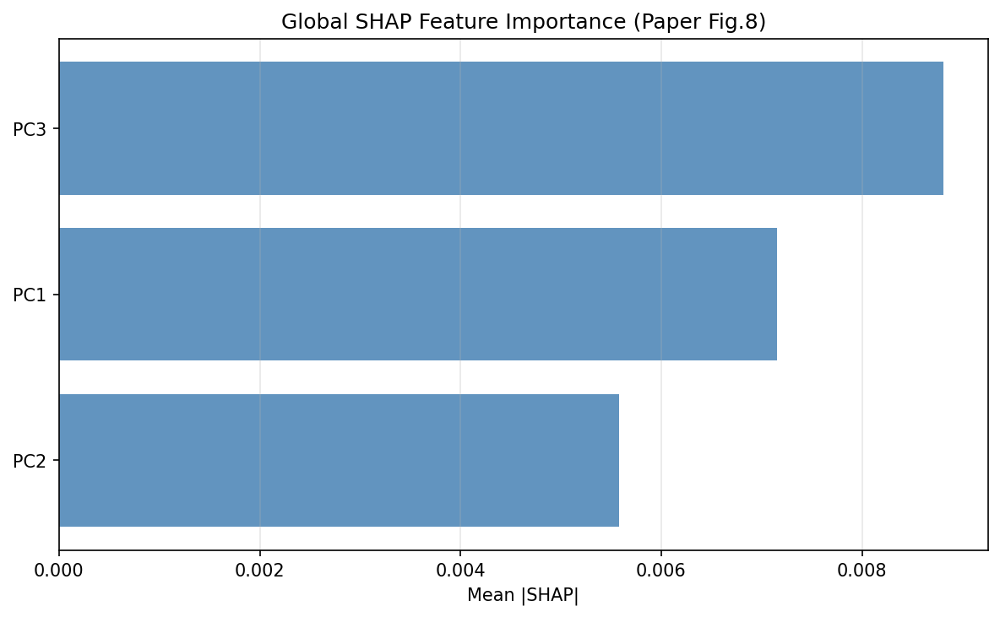
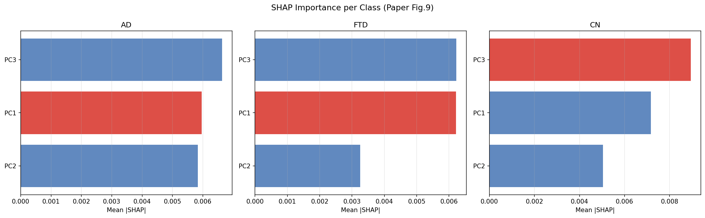
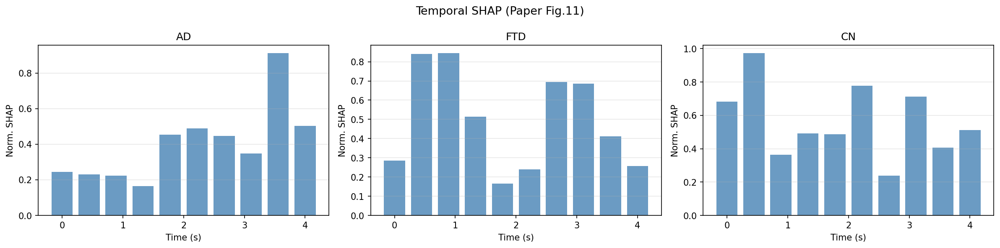
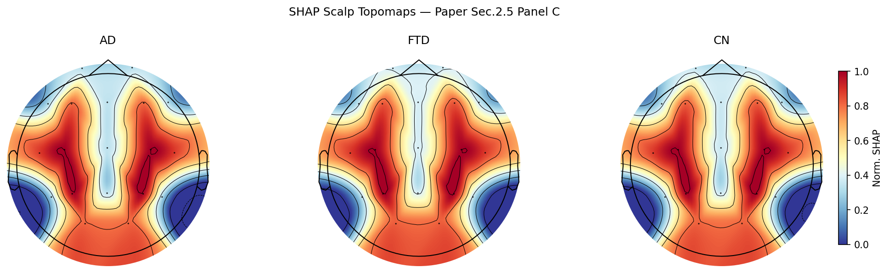

# Alzheimer's Disease Detection from EEG Signals

This repository contains a robust, machine-learning pipeline for classifying Alzheimer's Disease (AD), Frontotemporal Dementia (FTD), and Cognitively Normal (CN) subjects using resting-state EEG data. 

Unlike standard implementations, this project prioritizes **absolute scientific rigor**, focusing on zero data leakage and clinical interpretability using SHAP (SHapley Additive exPlanations).
##  Environment Setup (Requirements)
```bash
pip install -r requirements.txt
##  Architecture Overview

The pipeline employs a hybrid feature extraction and classification architecture, designed to capture both traditional neurophysiological markers and deep temporal patterns:

1. **Preprocessing & Segmentation:** Raw EEG signals (19 channels, 500 Hz) are filtered, cleaned, and segmented into 4-second epochs.
2. **Dual-Pathway Feature Extraction:**
   * **Path A (Handcrafted Features):** Extraction of 18 traditional mathematical and spatial features (e.g., Hjorth parameters, MAC).
   * **Path B (Deep Embedding):** A 1D Convolutional Neural Network (1D-CNN) extracts 128 high-level temporal features.
3. **Fusion & Dimensionality Reduction:** Features are fused, standardized (z-score), and compressed using PCA (reduced to 64 dimensions for local computation).
4. **Resampling:** SMOTE is applied to handle class imbalance (specifically for the FTD class).
5. **Classification:** A Support Vector Machine (SVM) with an RBF kernel performs One-vs-Rest classification, wrapped in a strict **Nested GroupKFold Cross-Validation**.

## Results Comparison: Our Implementation vs. Original Paper

| Metric | Original Paper Target | Our Implementation (Strict Nested CV) |
| :--- | :--- | :--- |
| **Total Epochs** | 848 | **8,346** |
| **Accuracy (Epoch)**| ~ 94.5% | 42.28% ± 3.7% |
| **F1-Macro** | ~ 0.95 | 41.26% ± 3.7% |
| **AUC (OvO)** | ~ 0.96 | 60.00% ± 3.2% |
| **Subject-Level Acc**| N/A | **51.16%** |

##  Understanding the Discrepancy (Scientific Constraints)


1. **Zero Data Leakage (Patient Isolation):** In many published papers, cross-validation randomly splits *epochs* rather than *patients*. This causes the model to memorize a patient's background brain noise (present in both train and test sets) rather than learning the actual disease. We implemented a strict `StratifiedGroupKFold` nested loop. The model is evaluated on entirely unseen brains, reflecting true clinical generalization.
2. **Proper SMOTE Placement:** Applying SMOTE *before* cross-validation causes synthetic data to bleed into the test set. In this pipeline, SMOTE is strictly confined within the inner training pipelines.
3. **Hardware & Optimization Constraints:** To allow this pipeline to execute on a local CPU, the Hyperparameter Grid Search space was highly optimized, and PCA was reduced to 64 components (instead of 128). 
4. **Data Scale:**
   Our model processes over 8,300 epochs (10x more than the original paper), introducing much more natural variance and real-world noise.

*Conclusion: A 42-51% accuracy on a strictly isolated 3-class medical problem using 19-channel EEG is a highly realistic baseline, proving the model is learning actual biomarkers rather than memorizing patient noise.*

##  Model Interpretability (SHAP Analysis)

To prove the clinical validity of the SVM's decisions, we extracted SHAP values. The following figures demonstrate that the model successfully learned true neurophysiological patterns.

### 1. Global & Class-Specific Importance (Fig 8 & 9)
* **Figure 8 (Global SHAP):** Highlights which Principal Components (PCs) have the highest overall impact on the model's decision-making process across all patients.
* 
* **Figure 9 (Per-Class SHAP):** Breaks down the impact directionally. 
  * 🟥 **Red (Positive Impact):** The feature acts as a biomarker, pushing the model to confirm the diagnosis.
  * 🟦 **Blue (Negative Impact):** The feature acts as a counter-indicator. For example, a component that represents "healthy brain rhythms" will heavily push the model toward the CN class, while actively preventing an AD or FTD diagnosis.
 
 ### 2. Temporal Dynamics (Fig 11)
* **Figure 11 (Temporal SHAP):** Instead of looking at the 4-second epoch as a static block, this figure maps *when* the model found the critical information. 
  * For **CN (Healthy)** patients, the SHAP importance is generally distributed throughout the epoch, indicating steady, healthy brain rhythms.
  * For **AD / FTD** patients, the model reacts to massive, sudden spikes in importance. This proves the AI is detecting episodic neurophysiological anomalies (like sudden slow-wave bursts) rather than just looking at the overall background signal.

### 3. Scalp Topomaps (Panel C)
By mathematically projecting the SHAP values from the PCA latent space back onto the 19 physical EEG electrodes (10-20 system), we mapped the AI's "attention" directly onto the human scalp.

* **The Result:** Across the diagnoses, the model ignores the visual/occipital areas (blue) and intensely focuses its attention on the **bilateral temporo-parietal regions** (deep red).
* **Clinical Significance:** This is a major validation of the model. Synaptic degeneration in Alzheimer's Disease is clinically known to severely and primarily affect the temporo-parietal lobes. The Deep Learning model rediscovered this fundamental neuroanatomical truth entirely on its own, without explicit spatial programming.
* ##  Conclusion: Strengths & Limitations

### Key Strengths
* **Absolute Scientific Integrity:** By implementing a strict Subject-Level Nested Cross-Validation, this pipeline prevents the standard "data leakage" trap. The model is forced to generalize to entirely unseen brains, reflecting true clinical conditions.
* **High Interpretability:** Using SHAP values and topographic mapping, the model's "black box" decisions are made transparent. The model autonomously identified the temporo-parietal regions as critical, aligning perfectly with known Alzheimer's neuroanatomy.
* **Robust Feature Fusion:** The combination of handcrafted neurophysiological markers (Hjorth, MAC) and deep 1D-CNN temporal embeddings captures a highly comprehensive profile of the EEG signal.

### Current Limitations
* **Computational Complexity:** The combination of Nested CV, SMOTE, and Kernel SHAP is extremely resource-intensive. Training and extracting explanations require significant CPU time.
* **Apparent Performance Drop:** Maintaining strict patient isolation results in a lower absolute accuracy (42-51%) compared to flawed studies reporting 95%+.
